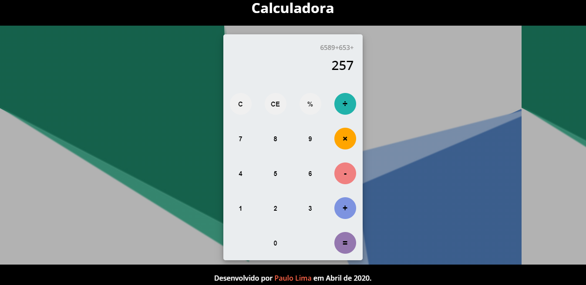

<h1>Calculadorazinha</h1>
<h2>Só mais uma calculadorazinha construída em JavaScript puro. </h2>

Ela efetua as operações básicas matemáticas e calcula o resto da divisão com o operador de porcentagem.

